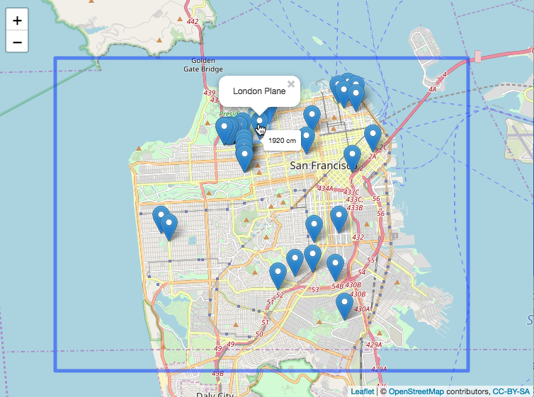
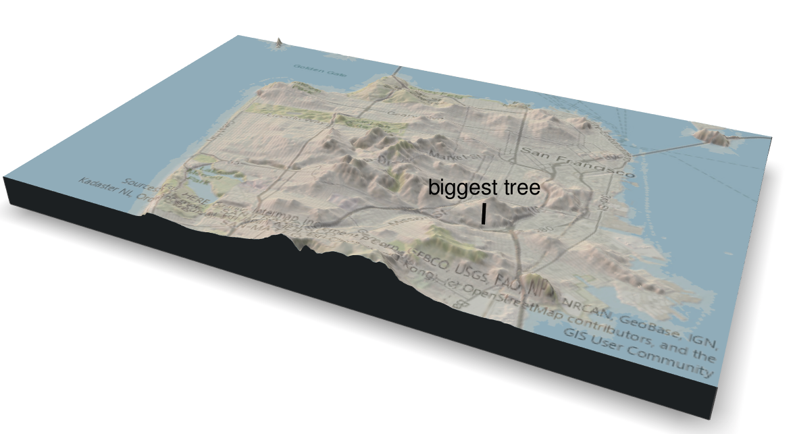

# San Francisco trees geospatial plotting

This project is a part of the weekly Data Viz community group at Fred Hutch.

The data are from the [January 28, 2020 Tidy Tuesday release](https://github.com/rfordatascience/tidytuesday/tree/master/data/2020/2020-01-28),
on San Francisco's tree locations and size.

- [`rayshader-demo.R`](rayshader-demo.R) is modified from Will Bishop's [I can rayshade, and so can you](https://wcmbishop.github.io/rayshader-demo/).
- [`sf_trees_notes.R`](sf_trees_notes.R) includes the basic data exploration for the trees data.
- [`sf_trees_rayshader.R`](sf_trees_rayshader.R) plots San Francisco and tree data using both `leaflet` and `rayshader`.

## Leaflet plot

This plot includes the largest trees in the dataset.
The original widget is interactive,
with mouseover data showing dbh (diameter at breast height)
and click species (common name).

## Rayshader plot

This plot shows the location of the biggest tree in the dataset.
The original plot is interactive;
the viewer is able to rotate the plot.

